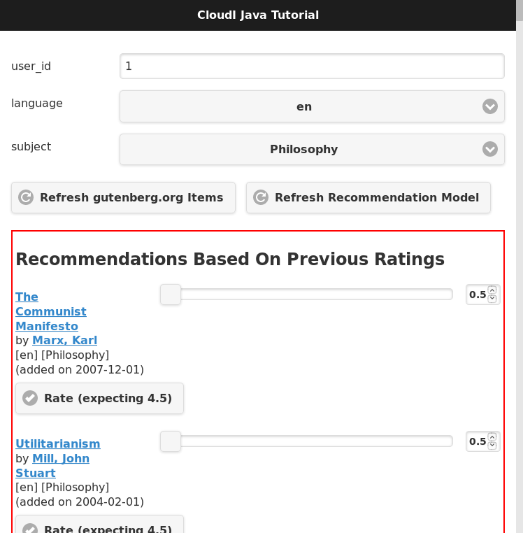

// process with "asciidoctor tutorial_java.adoc"
= CloudI Java Tutorial
:description: Cloud Framework for fault-tolerant distributed processing with dynamic load balancing
:keywords: tutorial, java, cloud, private cloud, framework, erlang, fault tolerant, distributed systems, embarrassingly parallel, divide and conquer, cloudi
:stylesheet: asciidoctor_default.css
:stylesdir: .
:linkcss:
:disable-javascript:
:idprefix:
:linkattrs:
:revnumber: 1.5.2
:revdate: 2016-09-01
:lang: en
:encoding: UTF-8
:toc:
:toc-title:
:toc-placement: header
:toclevels: 3
:nofooter:

== Reliable Book Recommendations

For an example of how CloudI can provide fault-tolerance for CloudI services implemented in Java we will explore how books can receive reliable recommendations.
We will use books data from link:http://www.gutenberg.org/[Project Gutenberg] and Java source code from the link:http://lenskit.org/[Lenskit recommendation toolkit] to provide reliable book recommendations.

=== Why Does Java Source Code Need CloudI To Be Reliable?

Any actively developed source code may have software errors which cause a system to fail but fault-tolerance makes the failure isolated (both in time and area).
With a software system gradually changing as requirements are added or removed it is important that reliability remains constant, despite developer mistakes.
While Java development relies upon exception handling for any runtime problems the scope of failures that exception handling can resolve is very limited.
If you consider the potential for memory leaks or corruption with Java Native Interface (JNI) usage, threading deadlocks or race conditions and memory exhaustion, it should be easy to understand that failures may occur in many unexpected ways.

Limiting the scope of a failure in Java source code requires isolated memory to make sure the failure is isolated.
The Java Virtual Machine (JVM) relies on the use of global state with stop-the-world Garbage Collection to manage its use of memory.
However, the lack of isolation in the JVM requires external management to limit the scope of failures within Java source code.

Typically Java source code uses an application server to provide external management as an Operating System (OS) process and CloudI provides application server functionality.
Many Java application servers include Java Message Service (JMS) and various Enterprise Service Bus (ESB) solutions exist for use in Java source code.
CloudI provides its own Enterprise Service Bus specifically for CloudI services so that service messaging and service lifetime can both be managed efficiently while keeping service memory isolated.
The approach in CloudI simplifies development so the focus can remain on business logic while CloudI handles any fault-tolerance or scalability concerns of the source code.

=== What Do Book Recommendations Look Like In CloudI?

The source code used in this tutorial is available at link:https://github.com/CloudI/cloudi_tutorial_java#readme[https://github.com/CloudI/cloudi_tutorial_java^].
A single Java CloudI service is used to provide a REST API that handles book recommendations with the following Uniform Resource Locator (URL) path suffixes:

|===
| URL Path Suffix         | HTTP Method | CloudI Service Name Pattern Suffix

| item/refresh            |        POST | item/refresh/post

| item/list               |        POST | item/list/post

| language/list           |        POST | language/list/post

| subject/list            |        POST | subject/list/post

| recommendation/refresh  |        POST | recommendation/refresh/post

| recommendation/update   |        POST | recommendation/update/post

| recommendation/list     |        POST | recommendation/list/post

| client                  |         GET | client/get
|===

The table above shows how the HTTP method becomes a suffix on the URL path to create the CloudI service name pattern suffix (cloudi_service_http_cowboy adds the HTTP method as a suffix in lowercase when sending the HTTP request data as a CloudI service request).
When the CloudI service is configured, a service name pattern prefix is provided to describe the scope of the service.
For the book recommendation Java service, the prefix "/tutorial/java/service/" is used so the full service name pattern for the table's first entry becomes "/tutorial/java/service/item/refresh/post".
A CloudI service name pattern suffix is used with a subscribe CloudI API function call to declare a service process will accept service requests with a matching service name.

When multiple processes and multiple threads are specified in the configuration of a CloudI service (with a count greater than 1), the same service will naturally call the subscribe CloudI API function more than once to declare multiple subscriptions.
A CloudI service that sends a service request with a matching service name will have the service request delivered to a service thread that is randomly selected from the available subscriptions.
Using random selection of a destination that matches the service name keeps the fault-tolerance of the receiving service constant (i.e., with the same probability of a failure for each receive).

All CloudI service request receives depend on a previous call to the subscribe CloudI API function.
However, both the send_sync and send_async CloudI API functions send a service request to a single destination.
To send a service request to all destinations that match a service name requires using the function mcast_async in the CloudI API, which is similar to publish functionality in other messaging systems.

==== What Is The Structure Of The Book Recommendation Service?

All services are structured for a 3 part sequence: initialization, handling-requests, and termination.
During CloudI service initialization, data structures are initialized to confirm that the service is ready for a runtime that may last indefinitely (making the  initialization stage the most critical stage for a service's reliability).
Inside the service initialization the subscribe CloudI API function is typically called so that incoming service requests are handled after initialization is done.
The book recommendation service initialization is shown below (from link:https://github.com/CloudI/cloudi_tutorial_java/blob/master/src/main/java/org/cloudi/examples/tutorial/Service.java#L90-L140[Service.java:90-140^]):

[source,java]
----
    public void run()
    {
        try
        {
            Main.info(this, "initialization begin");
            // initialization timeout is enforced
            // based on the service configuration value
            if (Service.lenskit() == null)
            {
                throw new RuntimeException("Lenskit initialization failed");
            }

            // subscribe to different CloudI service name patterns
            if (this.api.process_index() == 0 &&
                this.thread_index == 0)
            {
                // only a single thread of a single OS process
                // should handle items refresh due to filesystem usage
                this.api.subscribe("item/refresh/post",
                                   this, "itemRefresh");
            }
            this.api.subscribe("item/list/post",
                               this, "itemList");
            this.api.subscribe("language/list/post",
                               this, "languageList");
            this.api.subscribe("subject/list/post",
                               this, "subjectList");
            if (this.thread_index == 0)
            {
                // only a single thread in any OS process
                // should handle recommendation refresh due to global data
                this.api.subscribe("recommendation/refresh/post",
                                   this, "recommendationRefresh");
            }
            this.api.subscribe("recommendation/update/post",
                               this, "recommendationUpdate");
            this.api.subscribe("recommendation/list/post",
                               this, "recommendationList");
            if (this.thread_index != 0)
            {
                // persistent connections that lack a standard routing
                // identifier in their protocol (like websockets)
                // use the same service name for all requests
                // which must be routed based on the content of the request
                // (do not utilize thread 0, so that it can be used
                //  as a forward destination, for requests that require it)
                this.api.subscribe("client/get",
                                   this, "client");
            }

            Main.info(this, "initialization end");
...
----

The initialization sequence above shows that Lenskit is initialized first.
Afterwards, all the subscribe CloudI API function calls occur with a few choosing specific threads for execution.
You will notice that the Service object instant pointer `this` is provided with a string function name in the subscribe function call so that the service request will be handled in a specific function (Java 8 allows a single method reference to be used instead of these two separate parameters).
The "itemRefresh" service request can take a few minutes and creates filesystem data, so this request is only handled by a single thread within a single process (to make sure the execution is never parallel with other service threads).
The "recommendationRefresh" service request may take a minute or two with many recommendations but is updating global data in a single process, so it gets its own thread.
The "client" service request is used by the WebSocket interface to handle any of the service's functionality with a single WebSocket connection and its functionality will never block the occurrence of the "recommendationRefresh" service request.

All of the subscriptions that have been discussed are simply for CloudI service requests that define the interface of a REST API.
For the REST API to be used by HTTP requests, a HTTP server that creates CloudI service requests needs to be used.
CloudI includes two CloudI services that are HTTP Servers: cloudi_service_http_cowboy and cloudi_service_http_elli.
The book recommendation service will use cloudi_service_http_cowboy for handling both basic HTTP requests and WebSocket requests.

The initialization sequence ends when the poll CloudI API function is called to begin handling requests.

==== Handling Requests

CloudI service requests are processed in-memory and not persisted to disk because service requests are transient transactional data which may or may not represent a failure (only the sender really knows if it is a failure based on the response).
When a CloudI service request receives a response the transaction is complete.
To identify the transaction during its lifetime a globally unique Transaction Identifier (often named `trans_id` or `TransId` in the source code) is used within both the request and the response.

All CloudI service requests are able to receive a response.
The CloudI service that handles the request can make the request asynchronous by providing a "null response" (a response that has the response data and response_info data set to a binary of size 0) due to the control of the service request passing to the receiver when the service request is handled.
That means that the send_async CloudI API function call is an asynchronous send due to not waiting for a response to occur, though a response may be sent in the future if the receiving service decides to send a response.

An example of a service request handling function is below (using the "itemRefresh" function from link:https://github.com/CloudI/cloudi_tutorial_java/blob/master/src/main/java/org/cloudi/examples/tutorial/Service.java#L163-L209[Service.java:163-209^]):

[source,java]
----
    public Object itemRefresh(Integer command, String name,
                              String pattern, byte[] request_info,
                              byte[] request, Integer timeout,
                              Byte priority, byte[] trans_id,
                              OtpErlangPid pid)
    {
        // refresh all item data asynchronously
        final JSONItemRefreshRequest request_json =
            JSONItemRefreshRequest.fromString(new String(request));
        if (request_json == null)
        {
            return JSONItemRefreshResponse
                .failure("json")
                .toString().getBytes();
        }
        if (this.item_refresh_pending != null &&
            this.item_refresh_pending.isDone() == false)
        {
            return JSONItemRefreshResponse
                .failure("pending")
                .toString().getBytes();
        }
        final String D = System.getProperty("file.separator");
        final String executable_path = System.getProperty("user.dir") + D +
                                       "scripts" + D;
        final String executable_download = executable_path +
                                           "gutenberg_refresh_download";
        final String executable_cleanup = executable_path +
                                          "gutenberg_refresh_cleanup";
        final String directory = System.getProperty("java.io.tmpdir") + D +
                                 (new API.TransId(trans_id)).toString();
        final Connection db = Database.pgsql(Main.arguments());
        if (db == null)
        {
            return JSONItemRefreshResponse
                .failure("db")
                .toString().getBytes();
        }
        // item_refresh takes a long time, so it is done asynchronously
        this.item_refresh_pending = this.item_refresh_executor.submit(
            new GutenbergRefresh(this.idle,
                                 db,
                                 executable_download,
                                 executable_cleanup,
                                 directory));
        return JSONItemRefreshResponse.success().toString().getBytes();
    }
----

The contents of the service request is contained within the 9 function parameters to keep service request handling consistent with the avoidance of side-effects present in functional programming.
So, while it may seem a bit scary to have 9 function parameters you normally only need to focus on the `request` parameter which contains the request body.
The return value of the function provides the response body for the response to the service request.
HTTP requests do provide HTTP headers which is request meta-data and all request meta-data is put into the `request_info` parameter.

An important fault-tolerance constraint is the timeout on a service request (i.e., the `timeout` parameter) since it determines how long the service request is valid.
Every CloudI service request contains a specific timeout value in milliseconds which is decremented when the service request encounters any delay (e.g., due to queuing, handling execution, or forwarding).
The `priority` parameter controls the priority when a service request is queued and a service request is only queued while the service thread is busy with a separate service request.
The `command`, `name`, and `pattern` parameters show how the service request got here by containing whether the send is asynchronous or synchronous, the service name, and the service name pattern, respectively.
The `pid` contains the source of the service request as it is represented within the CloudI source code (it is the response destination).

While many of the parameters in a service request are just book-keeping for tracking the transaction, the service request can be forwarded through any number of service request handlers before a response is provided.
We can see in the source code example above that a JSON response is always returned as a byte array since the response data is always passed as binary data.
If it was necessary to add HTTP response headers in the response, they would be added to `response_info` data with the function returning a 2 element array that contains both the `response_info` meta-data and the `response` body, respectively.
However, nothing in CloudI enforces the format of the transaction contents (the `request_info` meta-data input, the `request` body input, the `response_info` meta-data output, and the `response` body output) to keep services loosely coupled.
By not enforcing the data format used in the transaction, CloudI remains protocol agnostic and allows services to fail naturally when they are unable to handle a format.
This approach keeps service development flexible so services can independently change at their own pace.

=== How Do Book Recommendations Occur?

To understand how book recommendations occur within the example source code, lets first get the source code running.

==== Creating Book Recommendations

Make sure you have Git, curl, Maven with Java 7 (or higher) and PostgreSQL running (>= 9.3).

Get a copy of the Java tutorial repository and open a shell in the repository directory:

[source,shell]
----
git clone https://github.com/CloudI/cloudi_tutorial_java.git
cd cloudi_tutorial_java
----

To create the CloudI service configuration for the services used in this tutorial use the following commands in your shell (with the repository directory as the current working directory):

[source,shell]
----
export JAVA=`which java`
export PWD=`pwd`
export USER=`whoami`
cat << EOF > website.conf
[[{prefix, "/"},
  {module, cloudi_service_filesystem},
  {args,
   [{directory, "$PWD/html/"}]},
  {dest_refresh, none},
  {count_process, 4}],
 [{prefix, "/tutorial/java/"},
  {module, cloudi_service_http_cowboy},
  {args,
   [{port, 8080}, {use_websockets, true}]},
  {timeout_async, 600000},
  {timeout_sync, 600000}]]
EOF
cat << EOF > tutorial.conf
[[{prefix, "/tutorial/java/service/"},
  {file_path, "$JAVA"},
  {args, "-Dfile.encoding=UTF-8 "
         "-Dorg.slf4j.simpleLogger.defaultLogLevel=warn "
         "-server "
         "-ea:org.cloudi... "
         "-Xms3g -Xmx3g "
         "-jar $PWD/target/cloudi_tutorial_java-1.5.1-SNAPSHOT-jar-with-dependencies.jar "
         "-pgsql_hostname localhost "
         "-pgsql_port 5432 "
         "-pgsql_database cloudi_tutorial_java "
         "-pgsql_username cloudi_tutorial_java "
         "-pgsql_password cloudi_tutorial_java"},
  {timeout_init, 600000},
  {count_thread, 4},
  {options,
   [{owner, [{user, "$USER"}]},
    {directory, "$PWD"}]}]]
EOF
----

The configuration for the Java tutorial CloudI services now is split into two separate files: website.conf (to run initial CloudI services using services that are included in CloudI for hosting the interface and handling HTTP connections) and tutorial.conf (to run the Java tutorial source code for handling book recommendation REST API requests).
The main reason to split the configuration is to make sure all HTTP requests have a 600000 milliseconds (10 minutes) timeout value.
The 10 minute timeout value for a HTTP request allows the Java service for book recommendations to be started dynamically with a 10 minute initialization timeout value for the Lenskit model creation (a 1-2 minute startup time is normal with lots of recommendation data).

Make sure you have PostgreSQL setup with a database that matches the Java service configuration arguments:

[source,shell]
----
psql -U postgres << EOF
CREATE DATABASE cloudi_tutorial_java;
CREATE USER cloudi_tutorial_java WITH PASSWORD 'cloudi_tutorial_java';
GRANT ALL PRIVILEGES ON DATABASE cloudi_tutorial_java to cloudi_tutorial_java;
EOF
----

Create the PostgreSQL schema with some test data:

[source,shell]
----
bunzip2 schema.sql.bz2
psql -h localhost cloudi_tutorial_java cloudi_tutorial_java < schema.sql
----

Now the tutorial services can be started by relying on the default CloudI configuration having cloudi_service_http_cowboy running on port 6464 so that CloudI Service API requests can be made dynamically (using cloudi_service_api_requests) to start new service instances:

[source,shell]
----
curl -X POST -d @website.conf http://localhost:6464/cloudi/api/rpc/services_add.erl
----

The result will be similar to `["ServiceId1","ServiceId2"]` where `ServiceId1` is a UUID (Universally Unique Identifier) for the new service instance of cloudi_service_filesystem and `ServiceId2` is a UUID for the new service instance of cloudi_service_http_cowboy.
The HTTP request above starts the new HTTP server service on port 8080 with the 10 minute timeout value and the web interface files.
Now we can use port 8080 for a CloudI Service API request so the 10 minute timeout value is used when initializing the book recommendation service:

[source,shell]
----
curl -X POST -d @tutorial.conf http://localhost:8080/cloudi/api/rpc/services_add.erl
----

The result will provide a single service ID for the new Java book recommendation service instance.
With all the tutorial services running successfully we can now look at the book recommendation interface at link:http://localhost:8080/tutorial/java/[http://localhost:8080/tutorial/java/].
The interface should look like the screenshot below:

image:images/tutorial_java_interface_01.png[Screenshot 1]

The green box surrounds the "Items Available" which are Gutenberg Project books included as test data within the `schema.sql` file.
Set a rating for an item and click the "Rate" button to store the rating.
The button will change to an "Update" button to allow the rating to change in the future.
Set two more ratings in the same way while keeping the user_id value set to `1`.
Change the user_id value to be `2`.
Set a rating for one of the items that was rated as user_id `1`.
The Lenskit recommendation model has not yet been updated based on other user ratings to create suggestions so click the "Update Recommendation Model" button (this update action is typically done weekly or daily with online services that have many users, when Lenskit is used in production).
The interface will update to show a red box that surrounds the "Recommendations Based On Previous Ratings" with expected ratings values that the recommendation model predicted, as shown in the screenshot below (your output will be based on the ratings you set, though it will look similar):

==== How Is The Book Recommendation Data Processed?

link:tutorial.html[Go Back]

